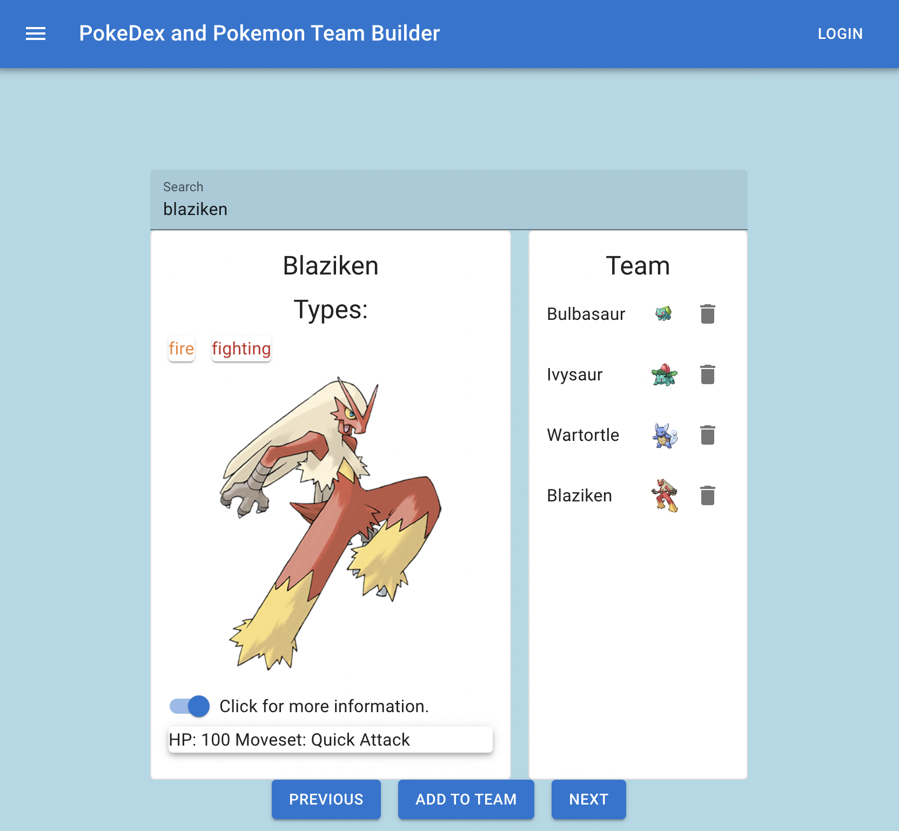
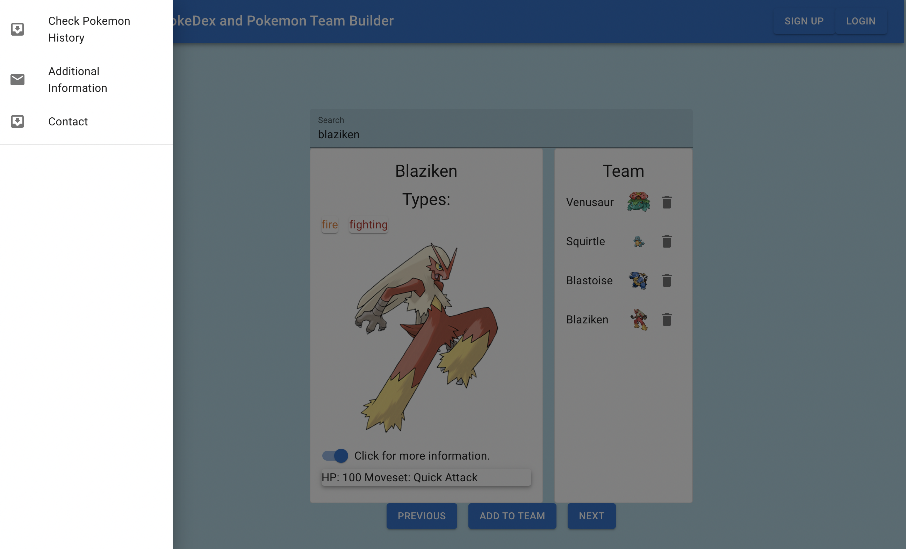

# Pokedex and Pokemon Team Builder

# Description

This is a PokeDex that uses the pokemonAPI to display information about all 898 Pokemon. There is also an option to build a team of up to 6 Pokemon. I am using Materials UI to build the user interface.

# Screenshots of the Landing Page

# Status
I am currently exploring further knowledge of node.js and plan to integrate a NoSQL database using MongoDB Atlas.

# Technologies Used

* MaterialsUI (https://mui.com/)
* Fetch API (https://developer.mozilla.org/en-US/docs/Web/API/Fetch_API)
* PokemonAPI v2 (https://pokeapi.co/)
* JSON-server (https://www.npmjs.com/package/json-server)

# Why did I build this?
I loved watching pokemon growing up and I believe that using the pokemonAPI is good practice as it contains many nested arrays in its JSON resource.

# User Stories

* Users will be able to press buttons to search through the list of pokemon.
* Users will be able to type in the name of the pokemon and search for a specific pokemon.
* Users will be able to add a team of pokemon up to a total of 6.
* Users will be able to login and see their team of Pokemon.
* Users will be able to select a team of up 6 pokemon.
* Users will be able to delete a pokemon from the list by clicking an Icon (In Progress).

# Credits
* Dave Borrel

